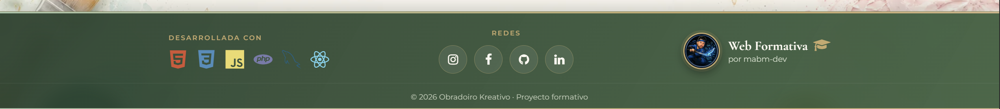
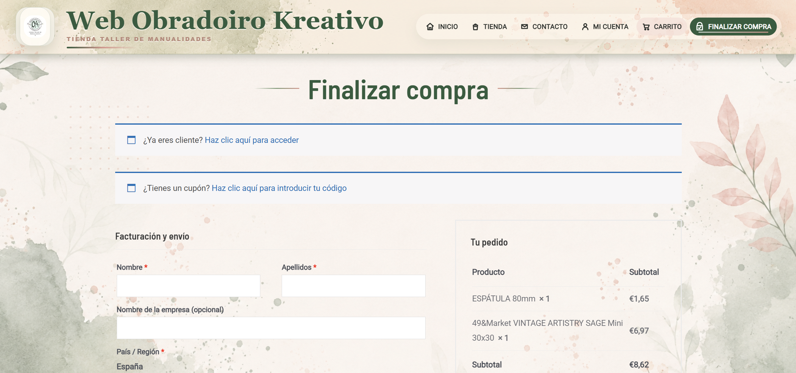
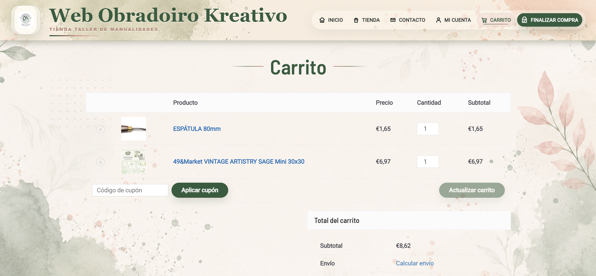
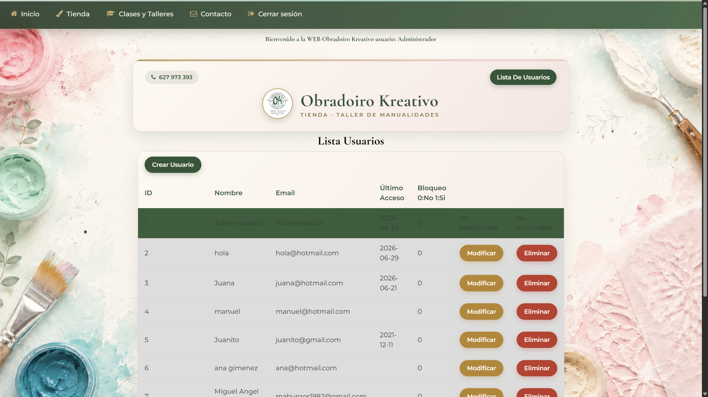
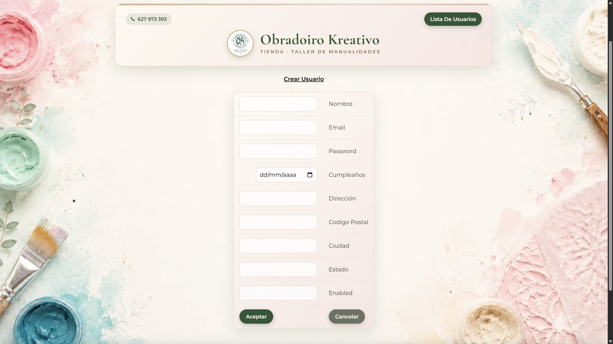
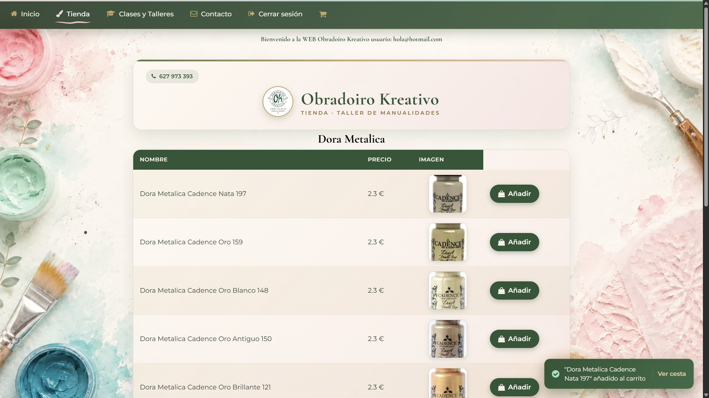
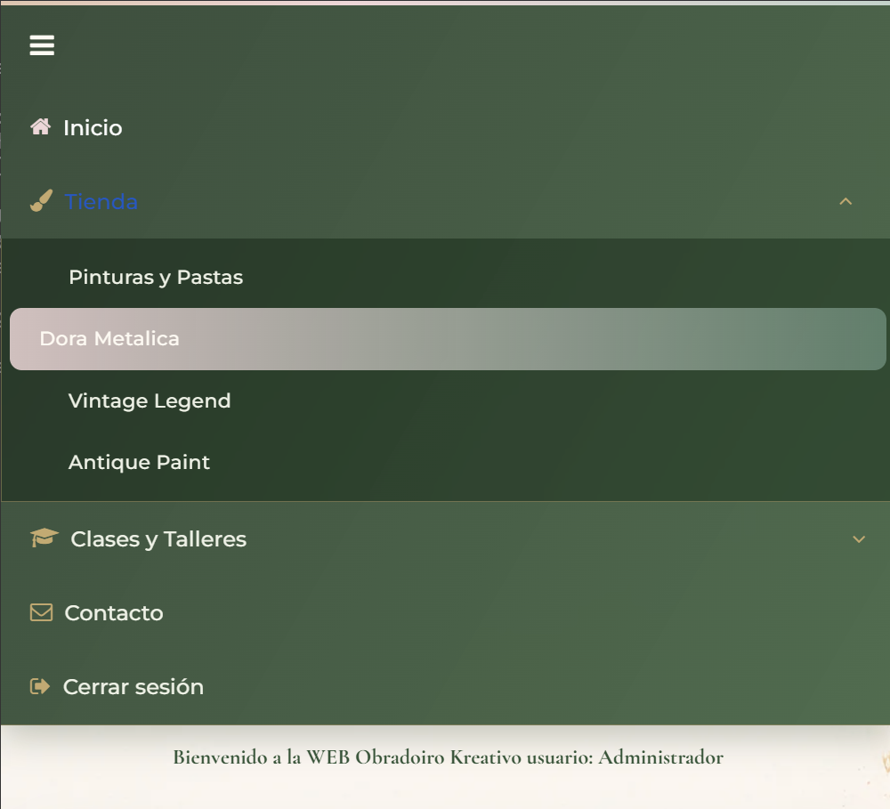

# Obradoiro Kreativo — Tienda online a medida (PHP · MySQL · Stripe)


Tienda online desarrollada **desde cero con PHP y MySQL** (sin framework) para una
tienda-taller de manualidades. Incluye catálogo por categorías, registro e inicio de
sesión seguros, carrito de compra con AJAX, integración de pago **Stripe en modo test/en desarrollo**, panel de
administración (CRUD) y un diseño responsive moderno.

> ⚠️ **Proyecto formativo / demostración.** La integración con **Stripe en modo test** está preparada/en desarrollo.
> Cuando esté activa, no cobrará dinero real y usará tarjetas de prueba de Stripe.

---

## 🛍️ Vista general


Web completa y funcional: navegación, tienda, clases y talleres, contacto, área de
cliente y panel de administrador. El foco está tanto en la **funcionalidad** (carrito,
pago, gestión) como en una **experiencia de usuario cuidada y profesional**.

## 📦 Qué incluye este repositorio

**Incluye:**
- Todo el **código fuente** de la web (PHP, CSS por secciones, JavaScript).
- Plantillas reutilizables y arquitectura modular.
- Plantillas de configuración (`config.example.php`, `configStripe.example.php`).

**NO incluye (por seguridad):**
- Credenciales de la base de datos (`config.php`).
- Claves de Stripe (`configStripe.php`).
- Copias de seguridad, archivos del IDE ni datos privados.

## 🛠️ Tecnologías utilizadas

| Área | Tecnología |
|---|---|
| Backend | PHP (sin framework), MySQL (mysqli + **consultas preparadas**) |
| Frontend | HTML5, CSS3 modular, JavaScript (jQuery puntual + JS nativo) |
| Interactividad | **React 18** (escaparate de la portada) |
| Pago | **Stripe Checkout** preparado para modo test (integración en desarrollo) |
| Otros | Bootstrap, Font Awesome |

## 🧩 Partes principales del trabajo

- **Diseño visual**: paleta cálida (verde + crema + dorado), *glassmorphism*,
  micro-interacciones y animaciones sutiles.
- **Header y menú**: pincelada de pintura animada, indicador de sección activa, submenús
  y versión móvil tipo acordeón.
- **Catálogo y carrito**: listados por categorías, **añadir al carrito por AJAX** con
  notificación *toast* y carrito con panel de resumen (subtotal · envío · total).
- **Pago**: integración con **Stripe Checkout** preparada para modo test. El objetivo es delegar el cobro en Stripe para no manejar datos de tarjeta en la web.
- **Administración**: panel con **CRUD** de usuarios y artículos.
- **Seguridad**: consultas preparadas (anti SQL-injection), contraseñas con
  `password_hash()` (bcrypt) y migración automática, listas blancas en `ORDER BY`.
- **Responsive**: sistema moderno con **Container Queries** y **`clamp()`**.

## 📸 Capturas

### Inicio
| Escaparate React | Cabecera y menú | Cabecera |
|---|---|---|
|  |  |  |

| Pie de página |
|---|
|  |

### Tienda y compra
| Catálogo de productos | Cesta | Pago (Stripe) |
|---|---|---|
|  |  |  |

| Método de pago | Resumen de la compra |
|---|---|
|  |  |

### Área de cliente
| Inicio de sesión | Registro | Contacto |
|---|---|---|
|  |  |  |

### Panel de administración
| Lista de usuarios | Modificar usuario |
|---|---|
|  |  |

| Gestión de productos | Modificar producto | Añadir producto |
|---|---|---|
|  |  |  |

### Responsive
| Vista tablet | Menú móvil | Menú móvil (selección) |
|---|---|---|
|  |  |  |

## 📁 Estructura del repositorio

```
code/
  css/             Hojas por secciones (base, menu, cabecera, pie, layouts, tablas...)
  js/              JavaScript (menú, carrito AJAX, validaciones)
  templates/       Plantillas PHP reutilizables (inicioPagina, finPagina, nav, ...)
  img/             Imágenes de la web
  *.php            Páginas (index, tienda, catálogos, cesta, pago, admin, ...)
screenshot/       Capturas usadas en este README
README.md
```

## 🚀 Puesta en marcha (local)

1. Clona el repositorio.
2. Copia las plantillas de configuración y rellénalas:
   ```bash
   cp code/config.example.php code/config.php
   cp code/configStripe.example.php code/configStripe.php
   ```
3. Crea la base de datos e importa las tablas (`user`, `articulo`, `carritodecompra`, `pedido`).
4. Sirve la carpeta `code/` con un servidor PHP (Apache/XAMPP o `php -S`).

> Para activar **Stripe**, el servidor debe permitir conexiones salientes
> a `api.stripe.com` (el hosting gratuito de InfinityFree las bloquea; usa un hosting que
> las permita, como Render o Railway).

---

## 📄 Licencia

Proyecto con fines educativos.
