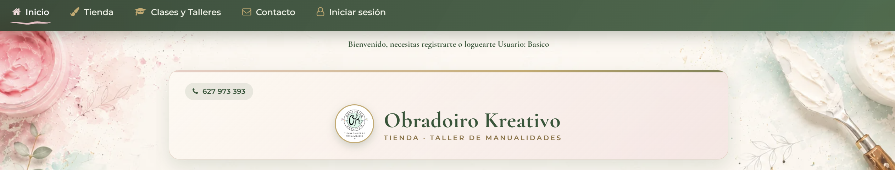
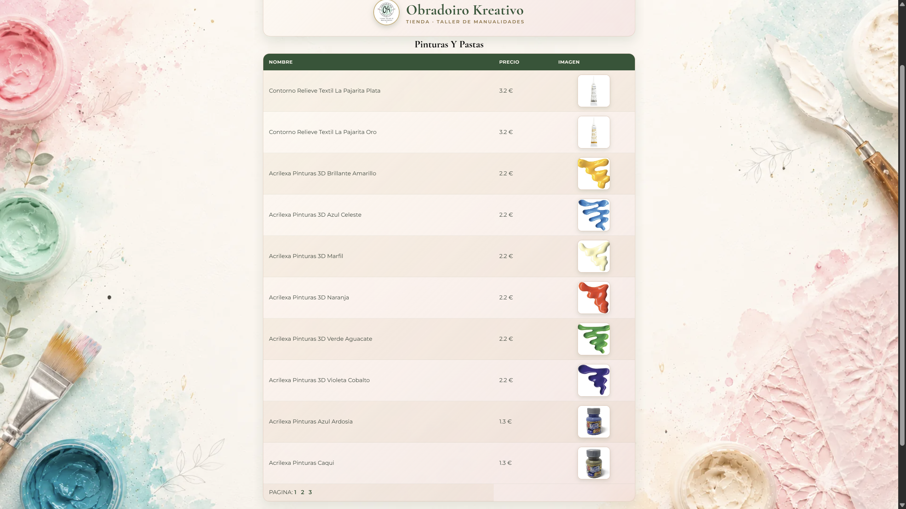
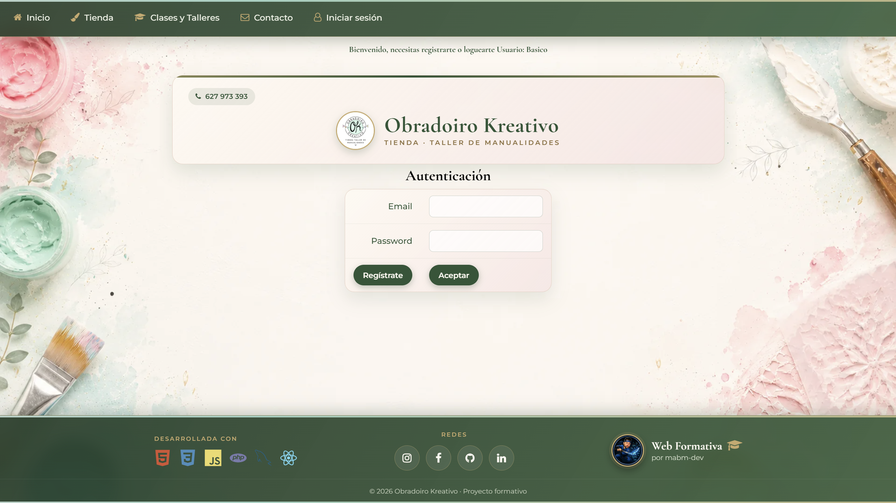
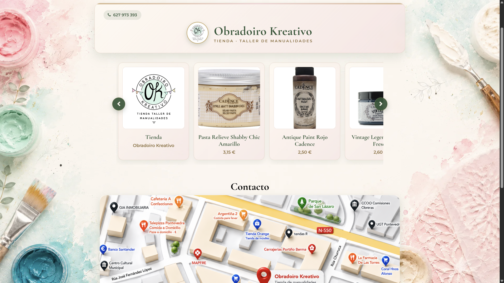
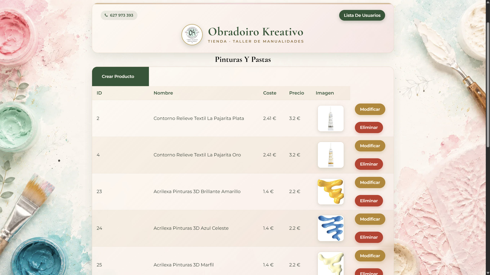
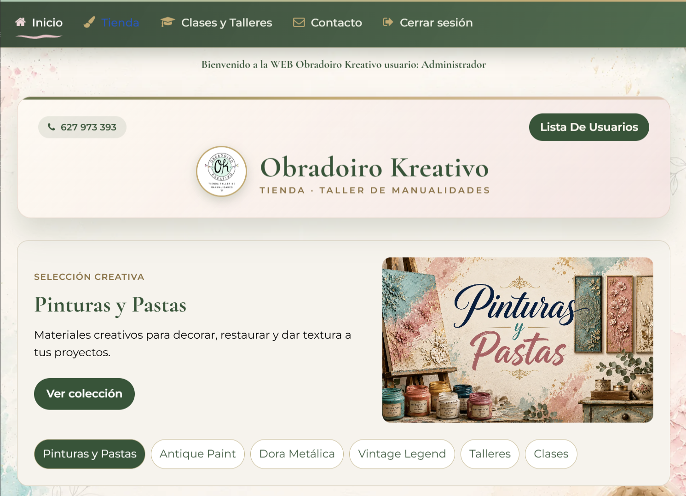
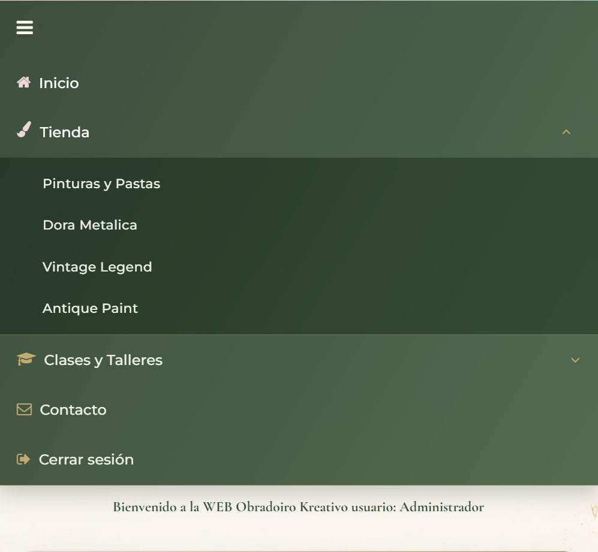

# Obradoiro Kreativo - Tienda online a medida con PHP y MySQL

Proyecto de desarrollo web de una tienda online creada desde cero con PHP y MySQL para una marca de manualidades, creatividad y formacion artesanal.

El objetivo del proyecto fue construir una version a medida de una tienda online, trabajando la logica propia de catalogo, usuarios, carrito, panel de administracion, estructura modular, seguridad basica y una interfaz visual coherente con la identidad de Obradoiro Kreativo.

## Vista general


## Que incluye este repositorio

Este repositorio contiene una aplicacion PHP organizada como portfolio tecnico. Esta preparado para mostrar el trabajo realizado de forma clara y segura, sin publicar credenciales ni datos privados.

Incluye:

- Codigo fuente PHP de la tienda.
- Conexion MySQL mediante archivo de configuracion externo.
- CSS modular por zonas de la interfaz.
- JavaScript para carrusel, validaciones e interacciones.
- Escaparate interactivo con React 18.
- Formularios de registro, login, carrito y administracion.
- Plantillas reutilizables para cabecera, menu, carrusel y footer.
- Capturas optimizadas del resultado final.
- Documentacion tecnica del proyecto.

No incluye:

- Credenciales reales de base de datos.
- Claves reales de Stripe.
- Datos reales de clientes o pedidos.
- Copias de seguridad privadas.
- Archivos propios del hosting gratuito.
- Configuraciones locales privadas.

## Tecnologias utilizadas

- PHP sin framework.
- MySQL con mysqli.
- HTML5.
- CSS3 modular.
- JavaScript nativo.
- jQuery puntual para interacciones existentes.
- React 18 para el escaparate de portada.
- Bootstrap.
- Font Awesome.
- Stripe Checkout preparado para integracion en modo test.

## Partes principales del trabajo

### Desarrollo a medida

La tienda se desarrollo sin framework para practicar la construccion manual de una aplicacion web: paginas PHP, plantillas reutilizables, conexion a base de datos, sesiones, formularios y gestion de entidades.

### Diseno visual

Se creo una identidad visual artesanal y calida, con fondos suaves, tarjetas de producto, cabecera personalizada, footer y una portada mas moderna mediante un escaparate interactivo con React.

### Header y menu

El menu se adapto para funcionar como eje de navegacion principal:

- Navegacion entre inicio, tienda, clases, talleres y contacto.
- Submenus para categorias de producto.
- Estado de usuario con inicio/cierre de sesion.
- Iconos de apoyo visual.
- Ajustes responsive para pantallas pequenas.

### Catalogo y carrito

El catalogo se organiza por categorias y productos. El carrito permite anadir articulos, revisar cantidades y avanzar hacia el flujo de pedido.

### Administracion

El proyecto incluye pantallas CRUD para gestionar usuarios y articulos, pensadas como panel de administracion basico para el mantenimiento de la tienda.

### Seguridad y datos

Se separaron las credenciales en archivos no versionados, se anadieron plantillas de configuracion y se trabajo la autenticacion con `password_hash()` y migracion de contrasenas antiguas.

### React

React se usa de forma puntual como mejora visual en la portada. No sustituye el flujo PHP de la tienda, sino que actua como escaparate interactivo que dirige a las paginas existentes.

### Stripe

La integracion con Stripe Checkout esta preparada/en desarrollo para modo test. El objetivo es delegar el pago en Stripe y no manejar datos de tarjeta dentro de la aplicacion.

## Capturas

### Inicio con escaparate React


### Cabecera y menu



### Cabecera


### Catalogo de productos



### Cesta


### Metodo de pago


### Checkout


### Area de cliente



### Registro


### Contacto



### Panel de administracion - usuarios


### Panel de administracion - productos



### Anadir producto


### Responsive tablet



### Menu movil



### Menu movil desplegado


### Footer


## Estructura del repositorio

```text
Obradoirokreativo-PHP/
├─ README.md
├─ .gitignore
├─ code/
│  ├─ css/
│  │  ├─ base.css
│  │  ├─ menu.css
│  │  ├─ cabecera.css
│  │  ├─ carrusel.css
│  │  ├─ paginas.css
│  │  ├─ pie.css
│  │  └─ tablas-formularios.css
│  ├─ js/
│  │  ├─ funciones.js
│  │  └─ react-escaparate.js
│  ├─ templates/
│  │  ├─ inicioPagina.php
│  │  ├─ finPagina.php
│  │  ├─ nav.php
│  │  ├─ header.php
│  │  ├─ carrusel.php
│  │  └─ footer.php
│  ├─ img/
│  └─ *.php
├─ docs/
│  ├─ configuracion-local.md
│  ├─ css-organizacion-notas.md
│  ├─ decisiones-tecnicas.md
│  ├─ estructura-repositorio.md
│  └─ seguridad-y-privacidad.md
└─ screenshots/
   ├─ inicio-react.png
   ├─ header-menu.png
   ├─ lista-productos.png
   ├─ finalizar-compra.png
   ├─ checkout.png
   ├─ contacto.png
   └─ movil-menu.png
```

## Puesta en marcha local

1. Clona el repositorio.
2. Copia las plantillas de configuracion y rellena tus datos:

   ```bash
   cp code/config.example.php code/config.php
   cp code/configStripe.example.php code/configStripe.php
   ```

3. Crea una base de datos MySQL e importa las tablas necesarias (`user`, `articulo`, `carritodecompra`, `pedido`).
4. Sirve la carpeta `code/` con Apache/XAMPP o un servidor PHP local.
5. Abre `index.php` desde el servidor local.

> Para activar Stripe, el servidor debe permitir conexiones salientes a `api.stripe.com`. Algunos hostings gratuitos bloquean esas conexiones.

## Documentacion

- [Configuracion local](docs/configuracion-local.md)
- [Decisiones tecnicas](docs/decisiones-tecnicas.md)
- [Estructura del repositorio](docs/estructura-repositorio.md)
- [Seguridad y privacidad](docs/seguridad-y-privacidad.md)
- [Notas de organizacion del CSS](docs/css-organizacion-notas.md)

## Nota sobre el proyecto

Este repositorio esta enfocado a mostrar una version de tienda online desarrollada a medida con PHP y MySQL. No pretende competir con una solucion CMS como WordPress/WooCommerce, sino demostrar la implementacion manual de funcionalidades habituales de una tienda online.

## Licencia

Proyecto con fines educativos y de portfolio.